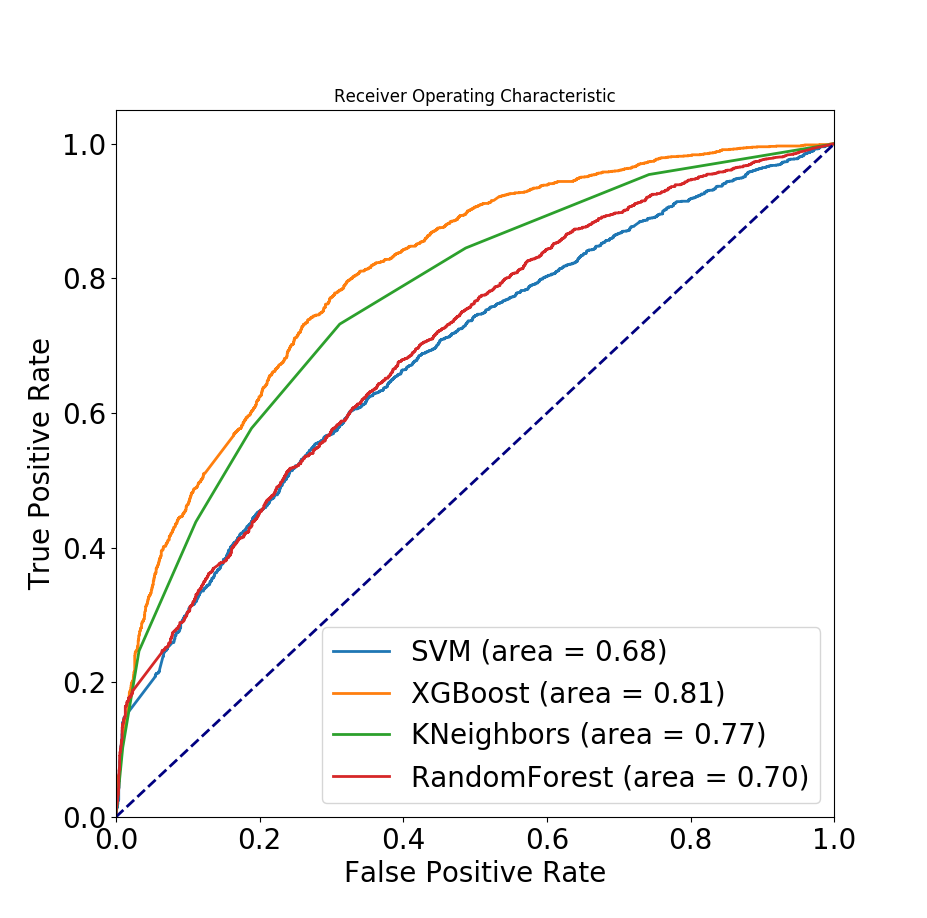
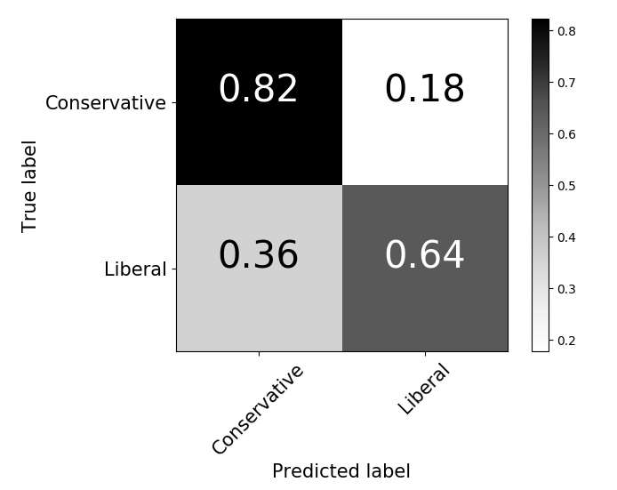
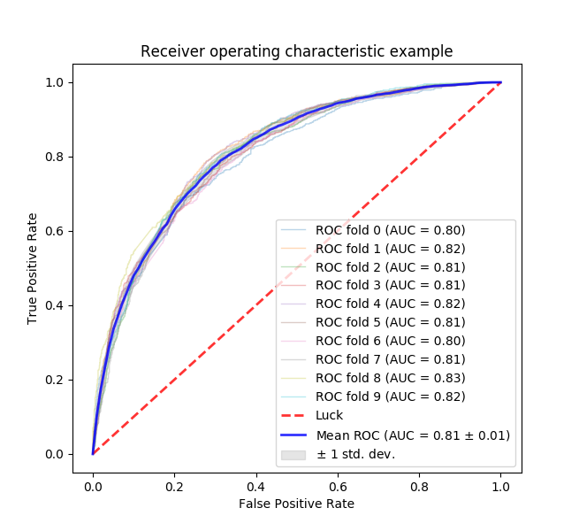

#      BubblePOP!        #

Bubblepop is a news recommender system designed to show you news from different sides of the political spectrum, so you can compare opposing viewpoints, evaluate the mertis of each and develop a more nuanced understanding of the issues.  Try it out at www.bubblepop.io !!     

##	How it works:	##
Bubblepop uses natural language processing and boosted classifiers on news article text to determine likely readership for complex news data scraped from posts made to politically aligned subreddits.  The posts come from two different sides of the political spectrum: liberal-leaning subreddits and conservative-leaning subreddits.  The subreddits used for liberals were: /r/politics, /r/liberal, /r/democrats and /r/socialism while those for conservatives were: /r/conservative, /r/republican, /r/the_congress and /r/libertarian.  I tried to balance the extent of liberalism and conservatism by cavasing the political spectrum on either side.  I scraped ~22k news articles from these subreddits using The Python API Wrapper(PRAW: https://praw.readthedocs.io/en/latest/) and Newspapers3k (http://newspaper.readthedocs.io/en/latest/).  I then used a pretrained Word2Vec model (https://code.google.com/archive/p/word2vec/) with a 3 million word vocabulary, trained on 100 billion words and phrases from Google News data to embed the words in each article in word vectors, and then took an average of the word vectors in each article to represent a document vector.  With the document vectors, I could characterize the liberal and conservative document space, as well as measure the euclidian distance between phrases and documents my model did not know, to determine related documents between search terms and documents.
##	The results	##

The figure above shows the receiver operating characteric curves of 4 different classisfiers classifying documents as appealing to either liberal or conservative readerships, solely based on the article's content.  I chose XGBoost because of its superior performance in the final model.

Above is a confusion matrix showing the results of using XGBoost to classify readership bias.

And, just to show that it's robust, here is 10-fold cross validation on XGBoost:

