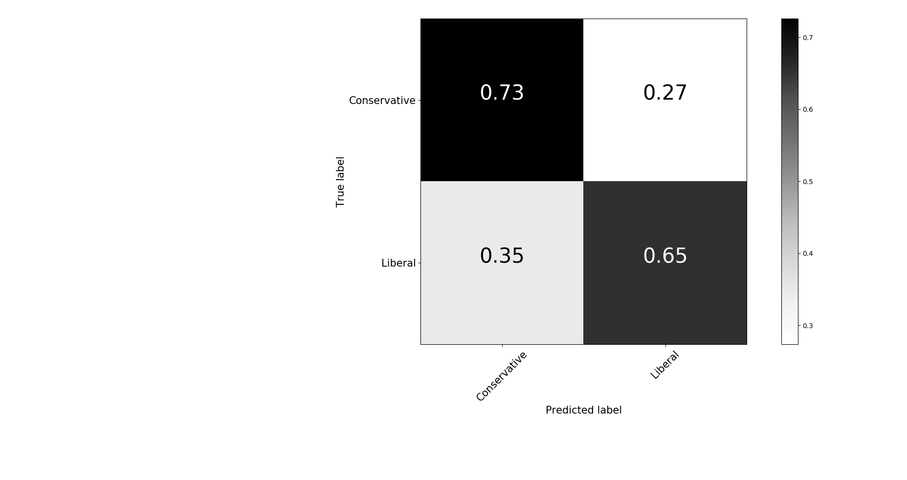
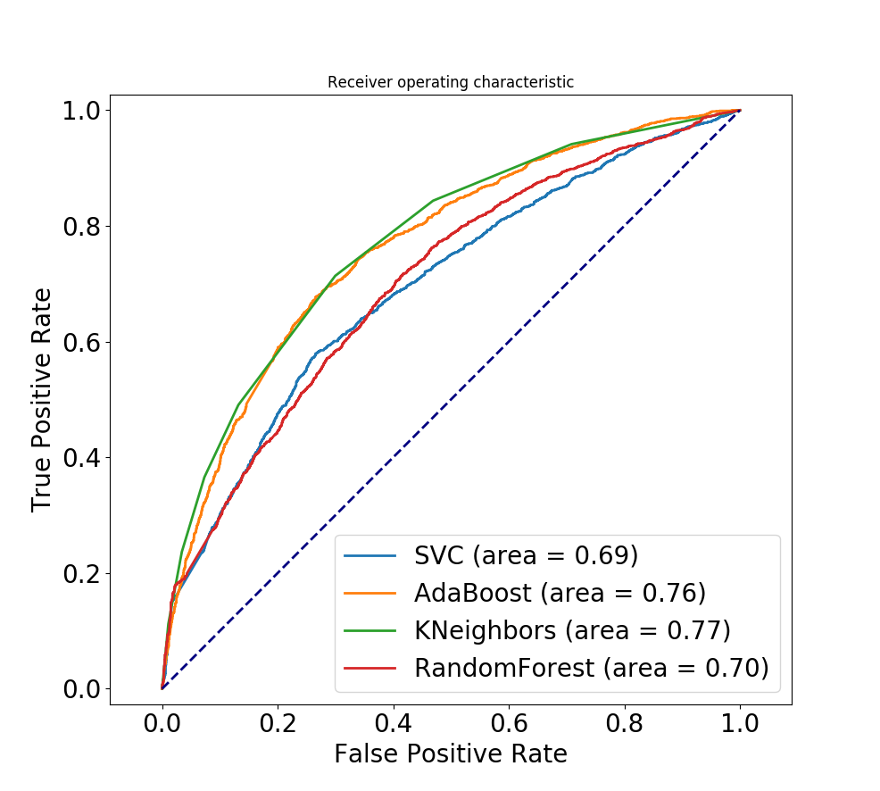

#      BubblePOP!        #

Bubblepop is a news recommender system designed to show you news from different sides of the political spectrum, so you can compare opposing viewpoints, evaluate the mertis of each and develop a more nuanced understanding of the issues.     

##	How it works:	##

Above is a confusion matrix showing the results of using AdaBoost to classify readership bias.##	The results	##

The figure above shows the receiver operating characteric curves of 4 different classisfiers.  I chose AdaBoost because of its superior performance in the final model.

And, just to show that it's robust, here is 10-fold cross validation on AdaBoost:

