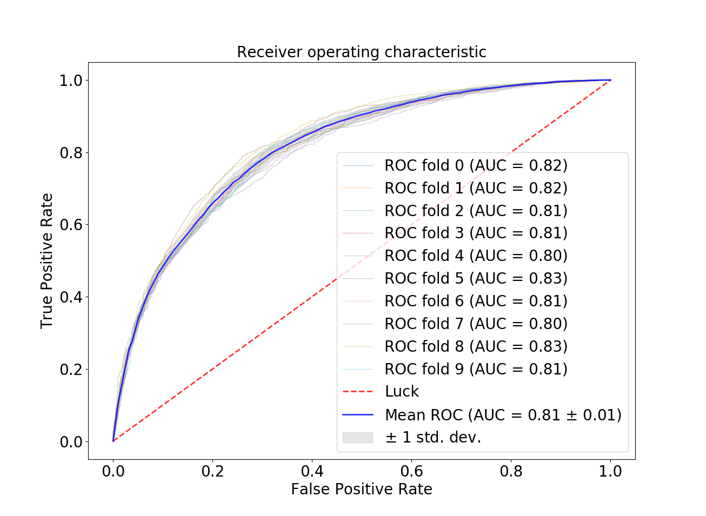

#      BubblePOP!        #

Bubblepop is a news recommender system designed to show you news from different sides of the political spectrum, so you can compare opposing viewpoints, evaluate the mertis of each and develop a more nuanced understanding of the issues.     

##	How it works:	##
Bubblepop uses natural language processing and boosted classifiers on news article text to determine likely readership for complex news data scraped from posts made to politically aligned subreddits.  The posts come from two different sides of the political spectrum: liberal-leaning subreddits and conservative-leaning subreddits.  The subreddits used for liberals were: /r/politics, /r/liberal, /r/democrats and /r/socialism while those for conservatives were: /r/conservative, /r/republican, /r/the_congress and /r/libertarian.  I tried to balance the extent of liberalism and conservatism by cavasing the political spectrum on either side.

Above is a confusion matrix showing the results of using AdaBoost to classify readership bias.##	The results	##

The figure above shows the receiver operating characteric curves of 4 different classisfiers.  I chose AdaBoost because of its superior performance in the final model.

And, just to show that it's robust, here is 10-fold cross validation on AdaBoost:

